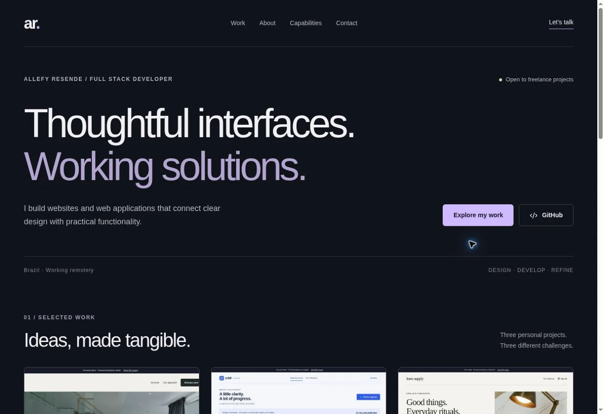

# Allefy Resende — Full Stack Portfolio

A professional, English-language portfolio with three personal demonstration projects. Built to present early-career work honestly: **no invented clients, commercial results, certifications or employment history**.



## Projects

| Project         | Experience                                                                 | Source and documentation                              |
| --------------- | -------------------------------------------------------------------------- | ----------------------------------------------------- |
| Portfolio       | Introduction, selected work, case studies, skills and direct email contact | [Portfolio README](docs/projects/portfolio/README.md) |
| Auren Studio    | Premium fictional architecture website and validated demo enquiry          | [Auren README](app/demos/auren/README.md)             |
| Orbit Workspace | Authenticated project CRUD, private per-user data, administrative overview | [Orbit README](app/demos/orbit/README.md)             |
| Form Supply     | Searchable catalog, product pages, persistent cart, simulated checkout     | [Form README](app/demos/form/README.md)               |

The projects share one application and deployment to avoid duplicated infrastructure. Each demo has its own route, visual identity and feature modules. They can be reviewed independently from the portfolio case studies.

## Stack

React 19, TypeScript, Vinext (Next.js App Router-compatible framework running on Vite), Cloudflare Workers, Cloudflare D1 (SQLite-compatible), Drizzle migrations, Zod, Radix/Shadcn primitives, Lucide icons and responsive CSS.

The application uses **Vinext, not a standard Next.js Node server**. Keep the included runtime/build integration when deploying.

## Run locally

Prerequisites: Node.js **22.13+**, npm and Git. Clone this repository, then run:

```bash
npm ci
npm run build
npm run db:migrate:local
npm run dev
```

Open the local address printed by the development server. No payment keys or email provider credentials are needed.

On an ordinary local (portable) checkout, `/signin-with-chatgpt?return_to=/demos/orbit/workspace` uses the starter's loopback-only development identity. This mock is not part of production. Managed development environments may disable it; see [authentication and deployment](docs/DEPLOYMENT.md).

The local database is stored in ignored `.wrangler/state/`. Do not commit it. `db:migrate:local` checks the local migration journal and applies pending migrations in order.

## Commands

```bash
npm run dev              # Development server
npm run typecheck        # TypeScript verification
npm run test:unit        # Catalog, validation and request guard tests
npm run test:api         # Local API integration tests (server must be running)
npm run format          # Format authored code and docs
npm run build           # Worker + client production build
npm start               # Preview built Worker locally
npm run db:generate     # Generate a new schema migration
npm run db:migrate:local # Apply pending local migrations
```

`test:api` defaults to `http://127.0.0.1:4173` for the managed preview. Set `TEST_BASE_URL` to your development server address for a normal local checkout. The script deliberately rejects non-loopback hosts. Tests use disposable fictional records and locally simulate trusted upstream identity headers; they are **not** an authentication bypass for a deployed site.

## Architecture

- `app/page.tsx`: portfolio homepage.
- `app/projects/[slug]`: data-driven project case studies.
- `app/demos/auren`: business website and demo enquiry form.
- `app/demos/orbit`: public read-only dashboard and authenticated workspace.
- `app/demos/form`: storefront, product details, cart and checkout.
- `app/api`: server-side validation, authorization and data operations.
- `lib/profile.ts`: editable name, contact and verified professional links.
- `lib/projects.ts`: project catalog; add a record here to add a case study.
- `lib/catalog.ts`: authoritative fictional product catalog and prices in integer cents.
- `db/`, `drizzle/`: database access, schema and versioned migrations.
- `components/ui`: installed accessible UI primitives.
- `public/images`, `public/screenshots`: optimized photographs and real browser captures.

## Contact and honest content

The real portfolio contact opens an email draft to the owner's confirmed address, `resendecrm.sites@gmail.com`. It also displays the owner's phone number (`+55 (35) 98402-6321`) with a call link and Discord username (`will009`) with a copy button. It does not claim to send an email automatically. The GitHub profile link is real. Each case study provides a downloadable source archive. LinkedIn is omitted until a verified URL is supplied; add it to `lib/profile.ts` when available.

Auren enquiries are validated locally but are not sent or stored. Orbit sample budgets are fictional estimates, not income or achieved results. Form checkout records a **simulated** order without collecting personal addresses or payment details.

## Publishing

See [Deployment guide](docs/DEPLOYMENT.md). The prepared target is Cloudflare Workers through Sites with a D1 binding named `DB`. A source ZIP is available as `/source-code.zip` in the deployed site. The complete application is **not compatible with GitHub Pages**, because the dashboard and cart require server APIs and a database. Keeping code on GitHub is independent from hosting the application.

A fresh Sites deployment starts owner-private. Make the portfolio public using the site's sharing settings before sending its URL to prospective clients. Only the demo workspace requires visitor authentication; the portfolio, Auren website and storefront work anonymously when the site is public.

## Adding work later

1. Create the new project route or provide a verified external demo URL.
2. Add the project description, actual technology stack, limitations and demo route to `lib/projects.ts`.
3. Add real desktop/mobile screenshots to `public/screenshots/` using the project's slug.
4. Add documentation. Keep personal concepts labeled as demonstrations until there is an actual client engagement.
5. Run type checking, relevant tests and the production build, then republish.

## Verification and limitations

See [QA report](docs/QA.md) for the actual checks and boundaries. This is a functional portfolio demonstration, not a payments platform or a certified business system. Hosted authentication is provided by the Sites dispatcher and requires that trusted boundary; do not expose the Worker directly while trusting arbitrary incoming identity headers.

Photography credits and licenses are listed in [ASSETS.md](docs/ASSETS.md). No affiliation with photographed product brands is implied.
