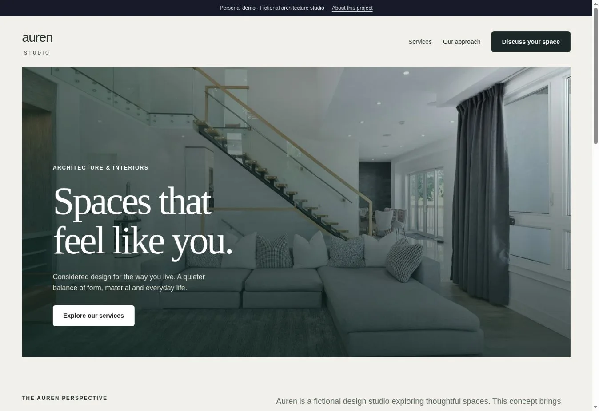
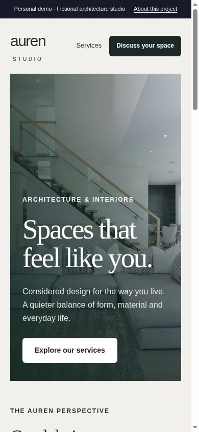

# Auren Studio

A premium, responsive business website for a fictional architecture studio.

**Personal demonstration by Allefy Resende. Not commissioned by a real client.**



## Features

- Editorial hero with optimized photography
- Services and process sections
- Responsive navigation and accessible form fields
- Client-side enquiry validation with explicit simulated feedback

## Run

From the repository root:

```bash
npm ci
npm run build
npm run db:migrate:local
npm run dev
```

Open `/demos/auren` on the local URL printed by the server. This module is part of the shared application; commands run from the root, not this directory.

## Publish

Run `npm run typecheck`, `npm run test:unit` and `npm run build`, then publish the repository through Sites with its D1 `DB` binding. Follow the [deployment guide](../../../docs/DEPLOYMENT.md). Keep the existing Site identity when updating this deployment. The full application requires a Worker runtime and cannot be deployed as a GitHub Pages static site.

## Main files

- `app/demos/auren/page.tsx`
- `app/demos/auren/enquiry.tsx`
- `app/globals.css`

## Scope

The enquiry form does not send or store messages. No real studio, client engagement or completed architectural work is claimed.

## Verification

See the [QA report](../../../docs/QA.md). Screenshots come from the implemented app, including a 390 × 844 mobile viewport.



## Stack and credits

React, TypeScript, Vinext/Vite, responsive CSS and accessible Radix/Shadcn components. Orbit and Form use server-side APIs, Zod validation and Cloudflare D1 with Drizzle migrations. See [image credits](../../../docs/ASSETS.md) and the [root README](../../../README.md).
