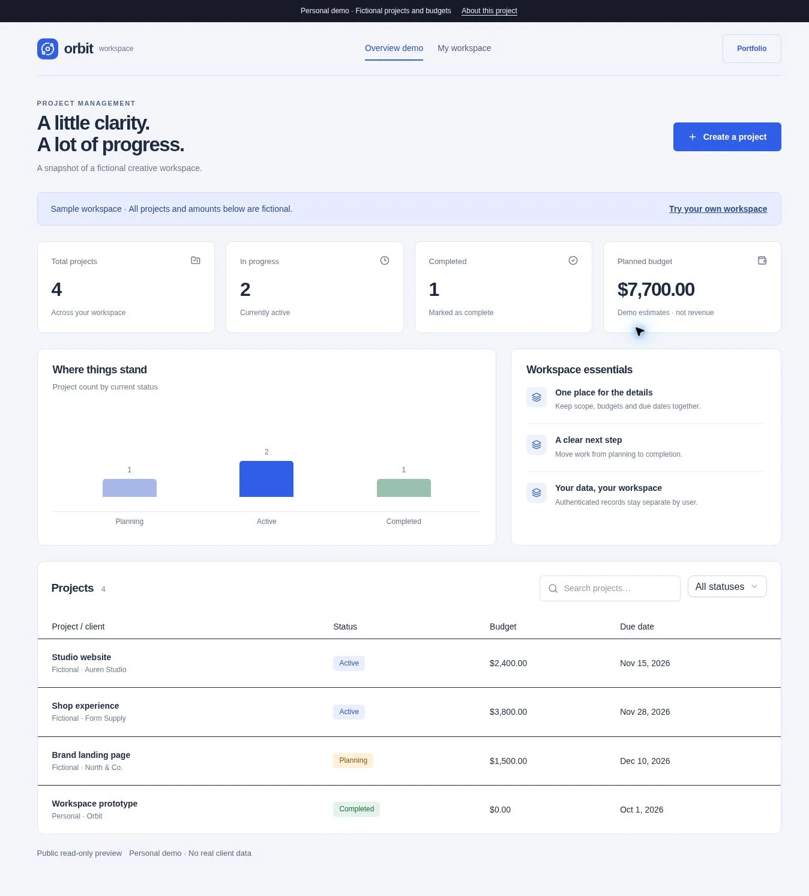
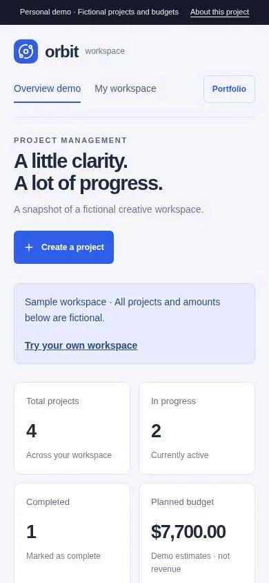

# Orbit Workspace

A full-stack project management demonstration with authentication, an administrative dashboard and persistent CRUD.

**Personal demonstration by Allefy Resende. Not commissioned by a real client.**



## Features

- Public read-only overview with fictional sample data
- Authenticated private workspace at /demos/orbit/workspace
- Create, read, update and delete projects through REST endpoints
- Server validation, user-scoped prepared SQL and D1 persistence
- Search, status filters, calculated counts and budgets

## Run

From the repository root:

```bash
npm ci
npm run build
npm run db:migrate:local
npm run dev
```

Open `/demos/orbit` on the local URL printed by the server. This module is part of the shared application; commands run from the root, not this directory.

## Publish

Run `npm run typecheck`, `npm run test:unit` and `npm run build`, then publish the repository through Sites with its D1 `DB` binding. Follow the [deployment guide](../../../docs/DEPLOYMENT.md). Keep the existing Site identity when updating this deployment. The full application requires a Worker runtime and cannot be deployed as a GitHub Pages static site.

## Main files

- `app/demos/orbit/dashboard.tsx`
- `app/api/orbit/projects/route.ts`
- `app/api/orbit/projects/[id]/route.ts`
- `lib/orbit.ts`
- `lib/orbit-server.ts`
- `db/schema.ts`

## Scope

Authentication on Sites uses Sign in with ChatGPT. No team roles, password accounts or commercial management promises. Mock identity exists only in supported local development. Sample amounts are not revenue.

## Verification

See the [QA report](../../../docs/QA.md). Screenshots come from the implemented app, including a 390 × 844 mobile viewport.



## Stack and credits

React, TypeScript, Vinext/Vite, responsive CSS and accessible Radix/Shadcn components. Orbit and Form use server-side APIs, Zod validation and Cloudflare D1 with Drizzle migrations. See [image credits](../../../docs/ASSETS.md) and the [root README](../../../README.md).
